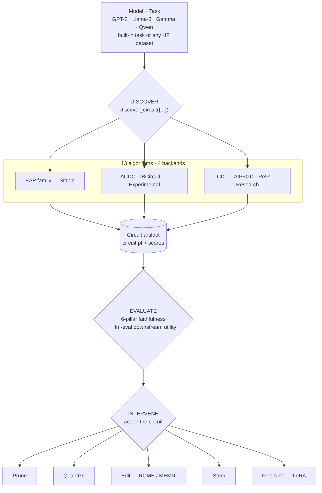
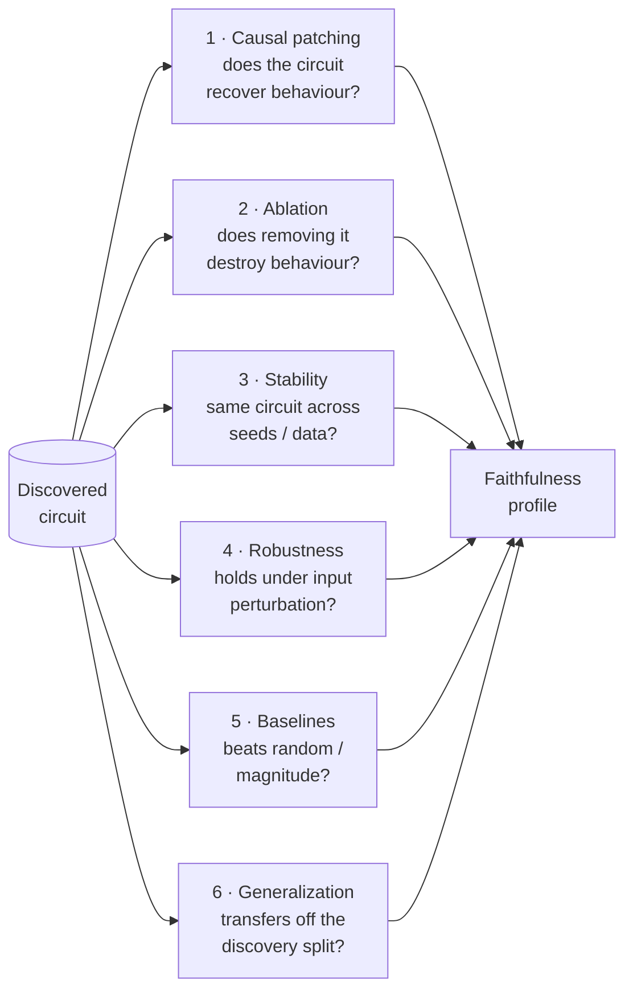
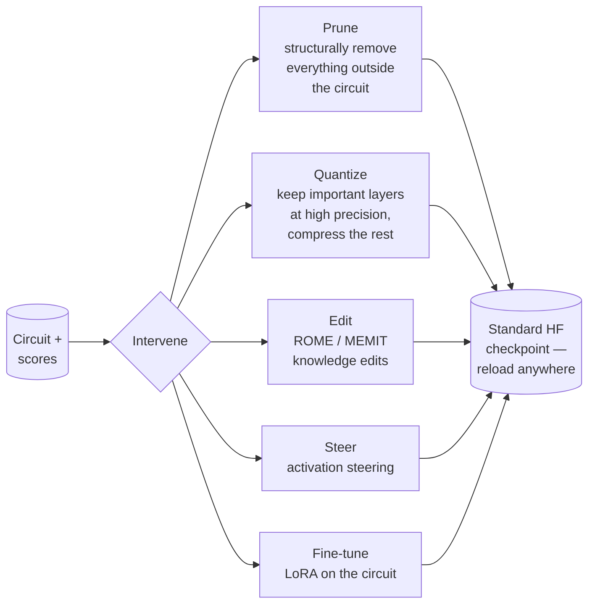
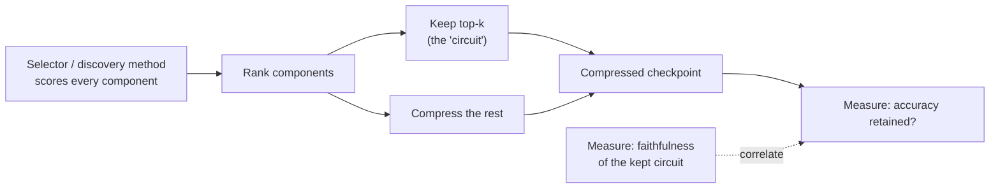

# Closing the Loop on Circuit Discovery: Introducing CircuitKit

*A toolkit that takes a discovered circuit and actually does something with it — prunes it, quantizes it, ships it as a real checkpoint, and tells you whether it was ever faithful in the first place.*

---

## The gap

Mechanistic interpretability has gotten good at one thing: **finding circuits**. Give a model a task and a modern attribution method — EAP, integrated-gradients EAP, ACDC — and you get back a subgraph of attention heads and MLPs with importance scores. That subgraph is supposed to be "the part of the model that does the task."

Then what?

In practice, "then what" is a pile of glue code. You discover a circuit with one of the EAP repos, which assumes its own data format. You sanity-check it with ACDC, which assumes another. You wire up TransformerLens for the model internals, a hand-rolled pruning script to act on the subgraph, and `lm-evaluation-harness` to see if the result still works. Every piece has its own model assumptions, and most of them are quietly GPT-2-era — they mis-tokenize chat models or break outright on grouped-query attention.

And almost all of that tooling **stops at the subgraph**. You get "here is a circuit and an attribution score." You do *not* get an answer to the question that actually matters: *is this circuit real enough to act on?*

**CircuitKit** is built to close that loop.

---

## Discover → Evaluate → Intervene

CircuitKit is a pipeline, not a grab-bag of scripts. You give it a model and a task; it does three things, through one config:



The whole workflow runs off one `discover_circuit({...})` config and a HuggingFace-dataset adapter, so it's identical whether you're running GPT-2 on IOI or an instruction-tuned Llama on your own dataset. It's usable three ways: a **Python API**, a **CLI**, or a **YAML config**.

Two design choices make it more than glue removal.

**1. It closes the loop.** CircuitKit is, as far as we know, the only library that takes a discovered circuit and *acts on it for real* — it structurally prunes or quantizes the model **down to the circuit**, writes a standard HuggingFace checkpoint you can reload anywhere, and then measures both **faithfulness** (does the circuit explain the behaviour?) and **downstream utility** (does the compressed checkpoint still score on `lm-eval`?). Most tooling treats a circuit as an explanation. CircuitKit treats it as something you ship.

**2. It targets modern models.** Discovery, chat-templating, and GQA/RoPE handling work on instruction-tuned Llama-3, Gemma, and Qwen — not just GPT-2. Each task carries a `chat_template_mode`, and discovery *freezes* the prompt-formatting policy so a circuit isn't misattributed to a prompt distribution the model is never actually run on.

---

## Stage 1 — Discover

Discovery is where the subgraph comes from. CircuitKit ships **13 algorithms across 4 backends**, organised into explicit **stability tiers** so you know what you're standing on:

| Tier | Algorithms | Use it for |
|---|---|---|
| **Stable** | EAP family (`eap`, `eap-ig`, …) | Production / paper results |
| **Experimental** | ACDC, IBCircuit | Cross-checks, research |
| **Research** | CD-T, AtP+GD, RelP, … | Method development |

Discovery runs at **node** granularity (whole attention heads / MLP blocks) or **neuron** granularity (individual MLP units), and the output is a portable `circuit.pt` artifact plus per-component scores.

```python
from circuitkit.api import discover_circuit

circuit = discover_circuit({
    "model": {"name": "gpt2", "precision": "float32"},
    "discovery": {
        "algorithm": "eap-ig",          # Stable-tier default
        "task": "ioi",                  # built-in task, or any HF dataset
        "level": "node",
        "data_params": {"num_examples": 32},
    },
    "pruning": {"target_sparsity": 0.3, "scope": "heads"},
    "output_path": "./circuit.pt",
})
```

The point of the tier table isn't bureaucracy — it's honesty. A research-tier backend that hasn't been cross-validated across model scales says so, out loud, instead of looking identical to a stable one.

---

## Stage 2 — Evaluate

A circuit is a *claim*: "these components explain this behaviour." CircuitKit pressure-tests that claim with a **6-pillar faithfulness framework** — not a single number, because a single number is easy to overfit to.



Crucially, evaluation doesn't stop at faithfulness. Because CircuitKit produces a **real, reloadable checkpoint** at the end of the intervention, it also benchmarks **downstream utility** through `lm-evaluation-harness` — the same way you'd evaluate any model. Faithfulness tells you whether the circuit *explains* the behaviour; the `lm-eval` score tells you whether the model you actually built still *works*. Keeping both numbers in the same pipeline is the whole point.

---

## Stage 3 — Intervene

This is the stage most interpretability tools don't have. Once you have a circuit, CircuitKit acts on it:



- **Prune** — structured pruning that removes whole heads and MLP blocks outside the circuit, down to a target sparsity.
- **Quantize** — mixed-precision quantization that keeps circuit-important layers at higher bit-width and compresses the rest.
- **Edit / Steer / Fine-tune** — ROME/MEMIT knowledge edits, activation steering, and LoRA fine-tuning, all scoped to the discovered circuit.

Every path ends at a checkpoint on disk. Pruned checkpoints are plain HuggingFace models — reload them with `AutoModelForCausalLM` and run them like anything else. Quantized checkpoints are saved in optimum-quanto's format and reload through CircuitKit's `load_quantized_checkpoint`. Either way, the artifact is a real model you can ship and benchmark, not just a subgraph.

---

## The question CircuitKit was built to answer

CircuitKit exists because of a research question: **if a circuit is faithful, is it a good thing to compress a model down to?**

It's an intuitive hypothesis. A faithful circuit is, by construction, "the part of the model that does the task" — so pruning everything else, or protecting the circuit's layers during quantization, *should* be a principled compression strategy. The faithfulness score should predict how well the compressed model survives.

CircuitKit makes that hypothesis directly testable. Treat each discovery method as a **selector** — a way to score components — and use that score as a compression criterion:



Run that across many selectors, two interventions (structured pruning and quantization), and a grid of models and tasks, and you can ask: **does a selector's faithfulness rank-correlate with the actionability — the accuracy you keep after compressing to its circuit?**

That's a question you can only *answer* with tooling that closes the loop — that actually compresses the model and measures what survives, instead of stopping at the subgraph. Running that audit rigorously — across many selectors, both interventions, and a grid of models and tasks — is ongoing research. CircuitKit is the instrument that makes the audit runnable in the first place, and that's the design it's built around.

---

## Correctness is a feature

Interpretability tooling has a specific failure mode: **a wrong number looks exactly like a right one.** A faithfulness score that's silently unnormalized, a structural prune that masks the wrong axis, a quantization step that's never actually persisted to the checkpoint — none of these crash. They just give you a plausible number that's wrong.

CircuitKit `1.0.0` shipped after a correctness-hardening cycle in which an audit found and fixed **10+ serious bugs in code that had already been marked "done"** — wrong-axis structural pruning, double-BOS tokenization, unnormalized faithfulness scores, an ACDC crash on grouped-query attention, quantization that was never written to the checkpoint. The full history is kept in [`CHANGELOG.md`](../../CHANGELOG.md) **on purpose**: for this kind of tooling, an honest fix log is the trust signal. The stability tiers exist for the same reason — a backend that hasn't been validated across model scales should not look like one that has.

---

## Get started

```bash
git clone https://github.com/Lexsi-Labs/circuitkit.git
cd circuitkit
pip install -e .
```

```python
import circuitkit
print(circuitkit.__version__)   # 1.0.0
```

CircuitKit needs Python 3.10+ and PyTorch 2.0+. Optional extras cover spaCy-backed
corruption strategies, `lm-evaluation-harness` integration, and docs/dev tooling.
The 60-second quickstart, the stability-tier table, and the capability matrix are
all in the [README](../../README.md); installation scenarios are in
[`docs/INSTALLATION.md`](../INSTALLATION.md).

---

## The one-line version

Most interpretability tools answer *"what is the circuit?"* CircuitKit answers the
next question — *"is the circuit real enough to act on, and what happens when you
do?"* — by discovering it, scoring its faithfulness six ways, compressing the model
down to it, and handing you a checkpoint you can reload and benchmark. The loop is
closed.

*CircuitKit is source-available (LSAL v1.1) — [github.com/Lexsi-Labs/circuitkit](https://github.com/Lexsi-Labs/circuitkit).*
