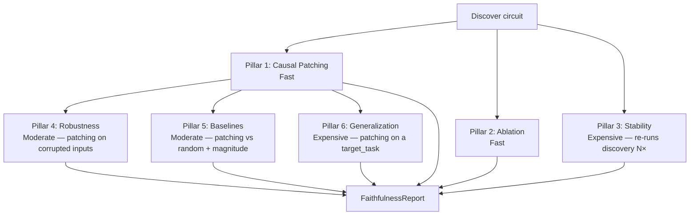

# 6-Pillar Faithfulness Framework

CircuitKit evaluates circuits with a 6-pillar framework. Each pillar tests whether the discovered circuit faithfully represents the model's computation.

## Why 6 pillars?

A circuit that looks good on one metric can fail on another:
- Recovers behaviour under patching (Pillar 1) and is sufficient when out-of-circuit nodes are ablated (Pillar 2)
- Passes 1+2 but is not stable across seeds (Pillar 3)
- Is stable but no better than random selection (Pillar 5)

The framework distinguishes genuinely faithful circuits from those that pass superficial checks.



!!! info "Pillars 4, 5, and 6 build on Pillar 1"
    Robustness, Baselines, and Generalization are not independent measurements — each re-runs the **Pillar 1 patching primitive** under a different condition: Robustness patches on corrupted inputs, Baselines patches random/magnitude circuits of the same size, and Generalization patches the circuit on a related target task. Only Pillars 1, 2, and 3 are computed directly from discovery.

<div class="grid cards" markdown>

-   :material-arrow-collapse:{ .lg .middle } **Pillar 1 — Causal Patching**

    ---

    Does patching back only circuit nodes recover the behaviour?

    Fast. [:octicons-arrow-right-24: Details](causal-patching.md)

-   :material-close:{ .lg .middle } **Pillar 2 — Ablation**

    ---

    Does the circuit alone suffice when out-of-circuit nodes are ablated?

    Fast. [:octicons-arrow-right-24: Details](ablation.md)

-   :material-refresh:{ .lg .middle } **Pillar 3 — Stability**

    ---

    Is the circuit consistent across re-discovery seeds?

    Expensive. [:octicons-arrow-right-24: Details](stability.md)

-   :material-shield:{ .lg .middle } **Pillar 4 — Robustness**

    ---

    Does the circuit hold under input corruptions?

    Moderate. [:octicons-arrow-right-24: Details](robustness.md)

-   :material-chart-bar:{ .lg .middle } **Pillar 5 — Baselines**

    ---

    Is the circuit better than random/magnitude selection?

    Moderate. [:octicons-arrow-right-24: Details](baselines.md)

-   :material-transfer:{ .lg .middle } **Pillar 6 — Generalization**

    ---

    Does the circuit transfer to a related task?

    Expensive. [:octicons-arrow-right-24: Details](generalization.md)

</div>

## Quick start

```python
from circuitkit.api import evaluate_circuit

results = evaluate_circuit({
    "model": {"name": "gpt2"},
    "discovery": {"algorithm": "eap-ig", "task": "ioi", "level": "node",
                  "data_params": {"num_examples": 256}},
    "pruning": {"target_sparsity": 0.3, "scope": "heads"},
    "output_path": "./circuit.pt",
    "eval": {"pillars": ["patching", "ablation", "baselines"]},
})
```

With Pipeline:
```python
pipe.evaluate(pillars=["patching", "ablation", "baselines"], n_examples=256)    # fast subset
pipe.evaluate(pillars=None, n_examples=512,          # full audit
              n_stability_runs=5, target_task="sva")
```

Low-level:
```python
from circuitkit.evaluation.full import run_full_faithfulness

report = run_full_faithfulness(model, graph, task_spec, cfg,
    pillars=["patching", "ablation", "baselines"],
    n_stability_runs=5, target_task_spec=None)
```

**Valid pillar name strings:** `"patching"`, `"ablation"`, `"stability"`, `"robustness"`, `"baselines"`, `"generalization"` — the six core pillars — plus `"intervention_reliability"`, a **7th auxiliary pillar** (measured separately, not one of the six).

!!! note "Pillar 3 (Stability) vs. intervention_reliability"
    Both re-run discovery across seeds, but they measure different things. **Pillar 3 Stability** scores *which nodes* get selected — node-overlap consistency across seeds (`mean_jaccard` / `mean_spearman`). **intervention_reliability** scores *the downstream effect* — the harmonic mean of the circuit-vs-baseline metric across seeds. A circuit can select stable nodes (high Stability) yet produce an unreliable effect, or vice versa.

## The FaithfulnessReport

```python
report.patching_score         # float: Pillar 1
report.ablation_score         # float: Pillar 2
report.stability              # Dict: Pillar 3
report.robustness             # Dict: Pillar 4
report.baseline_comparison    # Dict: Pillar 5
report.generalization         # Dict: Pillar 6
report.intervention_reliability  # Dict: optional auxiliary pillar
report.metadata               # Dict: run metadata
```

Fields are `None` if the pillar was not run.

## Cost summary (GPT-2, 256 examples, A100)

| Pillar | Time |
|---|---|
| 1 (Patching) | ~30s |
| 2 (Ablation) | ~30s |
| 3 (Stability) | ~10–15 min |
| 4 (Robustness) | ~3 min |
| 5 (Baselines) | ~2 min |
| 6 (Generalization) | ~5–10 min |

**Recommended:** Pillars 1+2 for iteration. Add 5 before reporting. All 6 for publication.

## Interpreting results

These are rough at-a-glance guides only; each pillar page carries the authoritative thresholds and may use tighter cutoffs (e.g. Stability uses ≥ 0.90 for "highly stable").

| Indicator | Weak | Strong |
|---|---|---|
| `ablation_score / patching_score` | < 0.70 | ≥ 0.85 |
| `ablation_score - random_avg` | < 0.20 | ≥ 0.40 |
| Stability Spearman | < 0.70 | ≥ 0.85 |
| Better than magnitude (Pillar 5) | No | Yes by ≥ 0.10 |

**`patching_score`** (Pillar 1) = normalized faithfulness ratio from causal patching,
(y_circuit − y_corrupt) / (y_clean − y_corrupt), clamped at 1.0.  
**`ablation_score`** (Pillar 2) = the same normalized ratio computed on the ablated circuit.

## Optional: Intervention reliability (7th auxiliary pillar)

An auxiliary measurement, separate from the six core pillars: across re-runs with different seeds, does the circuit produce a consistent *downstream effect* (circuit-vs-baseline metric)? This differs from Pillar 3 Stability, which instead scores whether the same *nodes* are selected across seeds.

```python
from circuitkit.evaluation.pillars.intervention_reliability import run_intervention_reliability

result = run_intervention_reliability(
    model, graph, task_spec, discovery_cfg, pruning_cfg,
    device=device, metric_fn=metric_fn, dataloader=dataloader,  # required — no defaults
    n_seeds=3,
)
# result["reliability_index"] — harmonic mean of R1/R2/R3 in [0, 1]
```

## Next steps

- [:octicons-arrow-right-24: Causal Patching](causal-patching.md)
- [:octicons-arrow-right-24: Ablation](ablation.md)
- [:octicons-arrow-right-24: Stability](stability.md)
- [:octicons-arrow-right-24: Robustness](robustness.md)
- [:octicons-arrow-right-24: Baselines](baselines.md)
- [:octicons-arrow-right-24: Generalization](generalization.md)
- [:octicons-arrow-right-24: Downstream Benchmarking](benchmarking.md)
