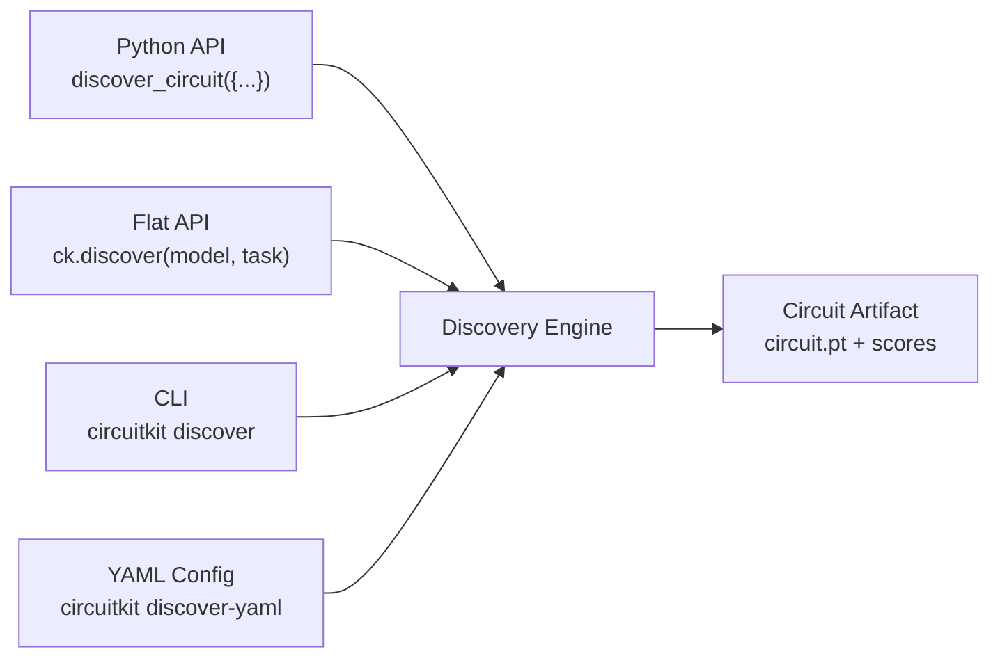

# Configuration

CircuitKit exposes the same discovery pipeline through five equivalent interfaces. All accept the same options; pick whichever fits your workflow.



| Interface | Best for |
|---|---|
| **Dict-config API** | Maximum flexibility; custom corruption and algorithm sub-options |
| **Flat typed API** (`ck.*`) | Clean one-shot calls with typed keyword arguments |
| **Pipeline** | Multi-step experiments; carries state across steps |
| **CLI** | Shell scripts, CI jobs, quick exploration |
| **YAML config** | Custom datasets without writing Python |

!!! tip "Any model works"
    Every snippet below takes a HuggingFace model id in the `model` field. The
    examples deliberately vary it — `gpt2` (CPU), `Qwen/Qwen2.5-0.5B-Instruct`,
    `meta-llama/Llama-3.2-1B-Instruct` — to show the interfaces are model-agnostic
    (also tested on Gemma 2 / 3 and Qwen 3). Llama and Gemma are gated on HF;
    `gpt2` and Qwen are open. **Pythia works for discovery and faithfulness
    evaluation only** — it is not a registered architecture, so the `prune`,
    `quantize`, and `export_checkpoint` steps shown below raise
    `UnsupportedArchitectureError` on it; use a registered family (gpt2, Qwen,
    Llama, Gemma, Mistral, Phi) for the full pipeline.

## Interface 1: Dict-config API

The lowest-level interface. Every other interface builds configs and calls this under the hood.

```python
from circuitkit.api import discover_circuit, evaluate_circuit, load_circuit

circuit = discover_circuit({
    "model": {
        "name": "gpt2",
        "precision": "float32",
    },
    "discovery": {
        "algorithm": "eap-ig",
        "task": "ioi",
        "level": "node",
        "data_params": {"num_examples": 128, "batch_size": 4},
    },
    "pruning": {
        "target_sparsity": 0.3,
        "scope": "both",
    },
    "output_path": "./circuit.pt",
})
```

Pass a YAML path instead of a dict for full equivalence:
```python
circuit = discover_circuit("./my_config.yaml")
```

## Interface 2: Flat typed API

```python
import circuitkit as ck

model = ck.load_model("Qwen/Qwen2.5-0.5B-Instruct", dtype="float32")
circuit = ck.discover(model, "ioi", algorithm="eap-ig", level="node",
                      n_examples=128, sparsity=0.3, output_path="./circuit.pt")
report = ck.faithfulness(model, circuit, "ioi", pillars=["patching", "ablation"])
pruned = ck.prune(model, circuit, sparsity=0.3, scope="both")
ck.export_checkpoint(pruned, circuit, "./output/ioi_pruned")
scores = ck.benchmark("./output/ioi_pruned", tasks=["boolq"], limit=100)
```

| Function | Description |
|---|---|
| `ck.load_model(name, ...)` | Load a HookedTransformer with EAP-compatible hooks |
| `ck.discover(model, task, ...)` | Run discovery, return a `Circuit` |
| `ck.faithfulness(model, circuit, task, ...)` | Score with 6-pillar framework |
| `ck.prune(model, circuit, ...)` | Structural pruning |
| `ck.quantize(model, circuit, ...)` | Circuit-guided quantization |
| `ck.export_checkpoint(model, artifact, path, ...)` | Write HF checkpoint |
| `ck.benchmark(checkpoint_path, tasks, ...)` | Run lm-evaluation-harness |
| `ck.load_scores(path)` | Load saved circuit from `.pt` |
| `ck.selective_finetune(circuit, ...)` | Select components for LoRA |
| `ck.visualize_circuit(circuit, ...)` | Visualize circuit |

## Interface 3: Pipeline (stateful)

```python
from circuitkit import Pipeline

pipe = Pipeline("meta-llama/Llama-3.2-1B-Instruct", task="ioi", precision="bfloat16", output_dir="./results")
pipe.discover(algorithm="eap-ig", level="node", n_examples=128, sparsity=0.3)
pipe.evaluate(pillars=["patching", "ablation", "baselines"], n_examples=256)
pipe.prune(sparsity=0.3, scope="both")
pipe.export("./results/checkpoint")
pipe.summary()  # prints a Rich table; summary() returns None
```

Alternative constructors:
```python
pipe = Pipeline.from_artifact("./circuit.pt", model_name="gpt2", task="ioi")
pipe = Pipeline.from_scores("./circuit_scores.pt", model_name="gpt2")
pipe = Pipeline.from_custom_data(model_name="gpt2", data_path="data.csv", ...)
```

## Interface 4: CLI

```bash
circuitkit discover --model gpt2 --algorithm eap-ig --task ioi \
    --sparsity 0.3 --level node --output ./circuit.pt
circuitkit evaluate --model gpt2 --artifact ./circuit.pt
circuitkit prune --model gpt2 --artifact ./circuit.pt --sparsity 0.3 --output ./pruned
circuitkit benchmark --models gpt2 --tasks ioi --algorithms eap-ig
circuitkit list-models
circuitkit validate-config --config my_config.yaml
```

## Interface 5: YAML config

**Task YAML** (for `discover-yaml`):
```yaml
# my_task.yaml
name: my_task
source:
  type: csv
  path: data.csv
schema:
  prompt: question
  answer: answer
  corrupted_prompt: other_question
  corrupted_answer: other_answer
corruption:
  strategy: token_swap
metric: logit_diff
```

**Pipeline YAML** (for `circuitkit run`):
```yaml
model: "gpt2"
task: "ioi"
discovery:
  algorithm: "eap-ig"
  level: "node"
  sparsity: 0.3
  n_examples: 128
evaluate:
  enabled: true
  pillars: [patching, ablation, baselines]
applications:
  - type: "prune"
    sparsity: 0.3
export:
  path: "./output/checkpoint"
```

## Next steps

- [Pipeline Overview](../user-guide/pipeline-overview.md) — stateful Pipeline deep dive
- [Custom Data](../user-guide/custom-data.md) — bring your own CSV/JSONL/HF dataset
- [YAML Configuration](../cli/yaml-config.md) — full YAML schema
