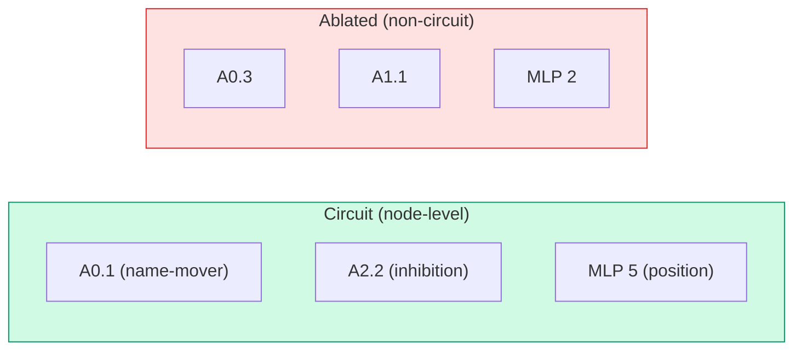

# Core Concepts

## Circuits

A **circuit** is a minimal subgraph of a neural network causally responsible for a specific behaviour. In transformers, a circuit identifies which attention heads, MLP layers, and neurons are necessary and sufficient to produce a particular output pattern.

The canonical example is **Indirect Object Identification (IOI)** [Wang et al. 2022]:

> "When Mary and John went to the store, John gave a drink to ___"

A GPT-2 circuit for this task includes ~10% of attention heads (name-mover, inhibition, induction roles). The remaining 90% can be ablated without degrading performance.

### Circuit representations

- **Node-level** (`level="node"`) — a list of component names like `['A0.1', 'A2.3', 'MLP 5']`. Faster, recommended default.
- **Neuron-level** (`level="neuron"`) — a nested dict mapping layers and heads to individual neuron indices. 5–10× more expensive.



## Circuit discovery

Discovery uses attribution methods to score every component by how much it contributes to the target behaviour. Components are ranked and the top-K are kept as the circuit.

CircuitKit implements this via `discover_circuit({...})`:

1. Loads the model and task
2. Runs the attribution method (e.g., EAP-IG)
3. Scores all components
4. Applies the pruning threshold (`target_sparsity`)
5. Writes the artifact (`.pt` + score side-cars)

### The 13 algorithms

| Backend | Algorithms | What it does |
|---|---|---|
| **EAP** | eap, eap-ig, eap-ig-activations, eap-clean-corrupted, + 6 research variants | Gradient-based edge attribution patching |
| **ACDC** | acdc | Greedy circuit-growing by edge removal |
| **IBCircuit** | ibcircuit | Information-bottleneck noise model |
| **CD-T** | cdt | Contextual decomposition through transformers |

See [Stability Tiers](../algorithms/stability-tiers.md) for tier definitions.

### The default: `eap-ig`

EAP with Integrated Gradients is the recommended default. It is **Stable** tier, runs in 1–15 minutes on GPU, works with instruction-tuned models, and is the algorithm used in the CircuitKit audit paper.

```python
from circuitkit.backends import default_algorithm, is_stable
print(default_algorithm())   # "eap-ig"
print(is_stable("eap-ig"))   # True
```

## Tasks and datasets

A **task** defines the input/output structure for discovery. It specifies:
- A dataset (clean and corrupted pairs, or clean-only)
- A **metric** (how to measure the model's output)
- A **corruption strategy** (how to generate paired corrupted inputs)
- A `chat_template_mode` (auto/on/off)

### 16 built-in tasks

| Task | Description | Metric |
|---|---|---|
| `ioi` | Indirect Object Identification | Logit-diff |
| `sva` | Subject-Verb Agreement | Logit-diff |
| `gender_bias` | Gender pronoun prediction | Logit-diff |
| `capital_country` | Country → capital city | Logit-diff |
| `hypernymy` | Hypernym prediction | Logit-diff |
| `greater_than` | Ordinal comparison | Logit-diff |
| `double_io` | Double indirect object | Logit-diff |
| `boolq` | Boolean QA | Logit-diff |
| `glue` | Text classification | Logit-diff |
| `mmlu` | Multiple-choice QA | Logit-diff |
| `winogrande` | Cloze commonsense | Suffix log-likelihood |
| `winogrande_mc` | Multiple-choice WinoGrande | Logit-diff |
| `truthfulqa` | TruthfulQA | Logit-diff |
| `ifeval` | Instruction following | Logit-diff |
| `wmdp` | Hazardous knowledge | Logit-diff |
| `gsm8k` | Math word problems | Answer-span NLL |

!!! note "Per-task metrics"
    Most tasks use single-token logit-difference. `winogrande` (suffix log-likelihood) and `gsm8k` (answer-span NLL) are deliberate exceptions.

Custom tasks: Any HuggingFace dataset via an adapter. See [Tasks and Datasets](../user-guide/tasks.md).

## Faithfulness evaluation

After discovery, CircuitKit evaluates the circuit across 6 pillars:

| # | Pillar | Question | Cost |
|---|---|---|---|
| 1 | **Causal Patching** | Does restoring only circuit nodes recover the behaviour? | Fast |
| 2 | **Ablation** | Does removing circuit nodes degrade behaviour? | Fast |
| 3 | **Stability** | Is the circuit consistent across re-discovery seeds? | Expensive |
| 4 | **Robustness** | Does the circuit hold under input corruptions? | Moderate |
| 5 | **Baselines** | Better than random/magnitude selection? | Moderate |
| 6 | **Generalization** | Does it transfer to related tasks? | Expensive |

Run a fast subset for iteration, or all six for a full audit:
```python
from circuitkit.evaluation.full import run_full_faithfulness

# Fast (Pillars 1+2 only)
report = run_full_faithfulness(model, graph, task_spec, cfg,
                               pillars=["patching", "ablation"])

# Full audit
report = run_full_faithfulness(model, graph, task_spec, cfg)
```

!!! warning "Pillar 6 is preliminary"
    Generalization is implemented but not yet validated at scale.

## Interventions

After discovery and evaluation, CircuitKit provides five ways to act on the circuit:

**Pruning** — removes lowest-scoring components, writes a real HF checkpoint:
```python
pruned = ck.prune(model, circuit, sparsity=0.3, scope="both")
ck.export_checkpoint(pruned, circuit, "./output/pruned")
```

**Quantization** — circuit-guided mixed-precision, protecting high-importance layers:
```python
plan = ck.quantize(hf_model, circuit, high_fraction=0.3, bits=4)
```

**Selective fine-tuning** — restricts LoRA adapters to circuit components:
```python
result = ck.selective_finetune(circuit, model_name="gpt2", top_fraction=0.2)
```

**Steering** — activation steering at circuit nodes:
```python
from circuitkit.applications.steering import ActivationSteering
steering = ActivationSteering(model, circuit_scores=circuit.scores)
```

**Knowledge editing** — ROME/MEMIT at circuit-identified MLP layers:
```python
from circuitkit.applications.editing import CircuitKnowledgeEditor
CircuitKnowledgeEditor(model).edit_via_circuit(
    prompt="The capital of France is", subject="France",
    target="Lyon", circuit=circuit, method="rome",
)
```

## Corruption strategies

Corruption generates paired (clean, corrupted) inputs for attribution. Must match the task structure.

| Strategy | What it does |
|---|---|
| **Entity swap** | Replace names/entities ("John" → "Alice") |
| **Paraphrase** | Rephrase while preserving semantics |
| **Distractor injection** | Insert misleading clauses |
| **Token swap** | Swap random tokens |
| **MCQ choice swap** | Swap correct/incorrect answers |

Paired datasets produce (clean, corrupted, clean_answer, corrupted_answer) quadruplets. IBCircuit and CD-T use clean-only datasets.

## Circuit artifacts

Every `discover_circuit` call writes three files:

| File | Contents |
|---|---|
| `circuit.pt` | Pruning artifact — node list or neuron dict |
| `circuit_scores.json` | Human-readable scores `{node_name: importance}` |
| `circuit_scores.pt` | Torch-serialized scores |

Load a saved circuit:
```python
import circuitkit as ck
circuit = ck.load_scores("./circuit.pt")
print(circuit.top_nodes(5))
```

## Supported models

| Family | Scale | Notes |
|---|---|---|
| GPT-2 | 124M–1.5B | Registered arch family. Fully validated, CPU-friendly |
| Llama 3 | 1B–3B | Registered arch family. Stable-tier EAP validated |
| Gemma | 2B–4B | Registered arch family. GQA detected at runtime; validated on Gemma-2-2B |
| Qwen 2.5 | 0.5B–7B | Registered arch family. Chat-template auto-detection |
| Pythia | 70M–12B | Discovery only (via TransformerLens); not a registered arch family |
| GPT-Neo | 125M–2.7B | Discovery only (via TransformerLens); not a registered arch family. GPT-NeoX (up to 20B) is a separate model |

## Next steps

- [Configuration](configuration.md) — choose between Python API, CLI, and YAML
- [Algorithms](../algorithms/overview.md) — algorithm selection guide
- [Evaluation](../evaluation/framework.md) — 6-pillar framework in depth

## References

- Wang, K., Variengien, A., Conmy, A., Shlegeris, B., & Steinhardt, J. (2022). "Interpretability in the Wild: a Circuit for Indirect Object Identification in GPT-2 Small." *ICLR 2023*. [arXiv:2211.00593](https://arxiv.org/abs/2211.00593)
- Elhage, N., Nanda, N., Olsson, C., & others. (2021). "A Mathematical Framework for Transformer Circuits." *Transformer Circuits Thread*. [Link](https://transformer-circuits.pub/2021/framework/index.html)
