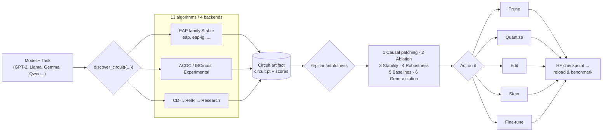

---
hide:
  - navigation
  - toc
---

<div class="ck-hero" markdown>

<div class="ck-hero-logo-wrap"></div>

<h1 class="ck-hero-title">Discover a circuit.<br><em>Then act on it.</em></h1>

<p class="ck-tagline">
CircuitKit is a unified framework for mechanistic interpretability.<br>
13 discovery algorithms · 6-pillar faithfulness evaluation · real interventions
</p>

[Get started](getting-started/index.md){ .md-button .md-button--primary }
[View on GitHub](https://github.com/Lexsi-Labs/circuitkit){ .md-button }

<p class="ck-chips">
<span>v1.0.0</span>
<span>LSAL v1.1</span>
<span>Python 3.10+</span>
<span>13 algorithms</span>
<span>6 pillars</span>
</p>

</div>

Given a model and a task, CircuitKit discovers the circuit driving that behaviour,
evaluates how faithful it is, and lets you act on it — prune, quantize, edit, steer,
or fine-tune — then export a reloadable HuggingFace checkpoint.</p>

<div class="grid cards" markdown>

-   :material-sitemap:{ .lg .middle } **13 discovery algorithms**

    ---

    EAP family (stable), ACDC and IBCircuit (experimental), CD-T (research) — each with
    explicit stability tiers. Only 2 (`eap`, `eap-ig`) are validated at production scale;
    the other 11 (2 experimental, 9 research) are not yet. Default: `eap-ig`.

    [:octicons-arrow-right-24: Algorithm overview](algorithms/overview.md)

-   :material-scale-balance:{ .lg .middle } **6-pillar faithfulness**

    ---

    Causal patching, ablation, stability, robustness, baselines, generalization.
    Six complementary checks, not one score.

    [:octicons-arrow-right-24: Evaluation framework](evaluation/framework.md)

-   :material-toolbox:{ .lg .middle } **Real interventions**

    ---

    Structural pruning, circuit-aware quantization, ROME/MEMIT editing, activation
    steering, circuit-restricted LoRA. Writes a reloadable HuggingFace checkpoint.

    [:octicons-arrow-right-24: Applications guide](user-guide/applications.md)

-   :material-chip:{ .lg .middle } **Modern models**

    ---

    Works on instruction-tuned Llama-3, Gemma, Qwen — not just GPT-2. GQA/RoPE,
    chat templates, grouped-query attention handled natively.

    [:octicons-arrow-right-24: Supported models](getting-started/core-concepts.md#supported-models)

</div>

## See it in 60 seconds

The `model` field is the only thing that changes across models — each tab below uses a different one (`gpt2` on CPU, `Qwen2.5` and `Llama-3.2` on GPU/MPS) to show the same workflow is model-agnostic.

=== "Dict-config API"

    ```python
    from circuitkit.api import discover_circuit, evaluate_circuit

    circuit = discover_circuit({
        "model": {"name": "gpt2", "precision": "float32"},   # CPU-friendly default
        "discovery": {"algorithm": "eap-ig", "task": "ioi",
                      "data_params": {"num_examples": 32}},
        "pruning": {"target_sparsity": 0.3, "scope": "both"},
        "output_path": "./circuit.pt",
    })
    results = evaluate_circuit({
        "model": {"name": "gpt2"},
        "discovery": {"algorithm": "eap-ig", "task": "ioi"},
        "pruning": {"target_sparsity": 0.3, "scope": "both"},
        "output_path": "./circuit.pt",
    })
    ```

=== "Stateful Pipeline"

    ```python
    from circuitkit import Pipeline

    # any HF model — Qwen 2.5 / 3, Llama 3, Gemma 2 / 3, Pythia, GPT-2 ...
    pipe = Pipeline("Qwen/Qwen2.5-0.5B-Instruct", task="ioi")
    pipe.discover(algorithm="eap-ig", n_examples=128, sparsity=0.3)
    pipe.evaluate(pillars=["patching", "ablation", "baselines"])
    pipe.prune(sparsity=0.3)
    pipe.export("./output/checkpoint")
    pipe.summary()
    ```

=== "CLI"

    ```bash
    # Llama & Gemma are gated — accept the license on HF, or swap for an open
    # model like Qwen/Qwen2.5-1.5B-Instruct. (This block prunes, so use a
    # registered arch — Pythia is discovery/eval only and cannot prune/export.)
    circuitkit discover --model meta-llama/Llama-3.2-1B-Instruct --algorithm eap-ig \
        --task ioi --sparsity 0.3 --level node --output ./circuit.pt
    circuitkit evaluate --model meta-llama/Llama-3.2-1B-Instruct --artifact ./circuit.pt
    circuitkit prune --model meta-llama/Llama-3.2-1B-Instruct --artifact ./circuit.pt \
        --sparsity 0.3 --output ./pruned
    circuitkit benchmark --models gpt2 Qwen/Qwen2.5-1.5B-Instruct --tasks ioi \
        --algorithms eap-ig --interventions prune
    ```

## How it works



## Tutorials & case studies

| Start here | Open | Hardware |
|---|---|---|
| **01** Quickstart Pipeline — discover → evaluate → prune → export | [](https://github.com/Lexsi-Labs/circuitkit/blob/main/examples/notebooks/01_quickstart_pipeline.ipynb) | no GPU |
| **02** Algorithm Comparison — 6 algorithms head-to-head | [](https://github.com/Lexsi-Labs/circuitkit/blob/main/examples/notebooks/02_algorithm_comparison.ipynb) | GPU helps |
| **03** Custom Data — bring-your-own CSV | [](https://github.com/Lexsi-Labs/circuitkit/blob/main/examples/notebooks/03_custom_data_jailbreak.ipynb) | GPU helps |
| **23** Jailbreak Safety Steering — circuit-restricted defense on Qwen 2.5 | [](https://github.com/Lexsi-Labs/circuitkit/blob/main/examples/case-studies/23-jailbreak-safety-steering.ipynb) | GPU (T4+) |

All 9 tutorial notebooks, the 13 numbered scripts, and 11 domain
[case studies](examples/case-studies.md) (compliance auditing, banking safety,
gender-bias mitigation, permanent unlearning, edge deployment) are catalogued
in the [Examples overview](examples/overview.md).

## Where next

| | |
|---|---|
| **[Getting started](getting-started/index.md)** | Install, quickstart, core concepts |
| **[Guides](guides/index.md)** | Per-topic usage guides with code |
| **[Trust & Audit](trust/index.md)** | Stability tiers, audit status |
| **[Reference](reference/index.md)** | API reference, CLI reference |
| **[Examples](examples/overview.md)** | Scripts, notebooks, and case studies |

---

## Cite

```bibtex
@software{circuitkit2026,
  title  = {CircuitKit: Circuit Discovery, Evaluation, and Application Toolkit
            for Mechanistic Interpretability},
  author = {Seth, Pratinav and Gosalia, Hem and Kasliwal, Aditya
            and Sankarapu, Vinay Kumar},
  year   = {2026},
  version = {1.0.0},
  url    = {https://github.com/Lexsi-Labs/circuitkit}
}
```

---

<div class="ck-lexsi-footer" markdown>
<a href="https://www.lexsi.ai">
  
  
</a>
<p><a href="https://www.lexsi.ai">https://www.lexsi.ai</a></p>
<p>Mumbai 🇮🇳 · Paris 🇫🇷 · London 🇬🇧</p>
</div>
