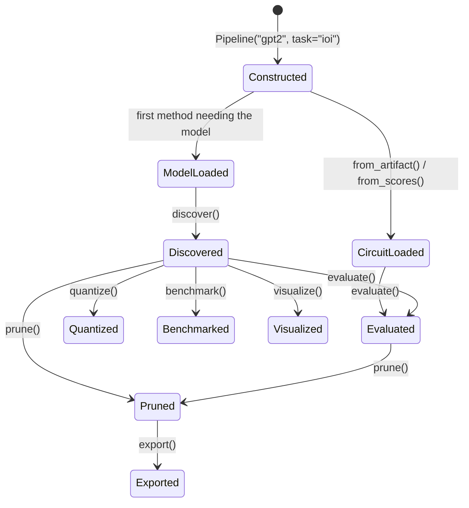

# Pipeline Overview

`Pipeline` is a stateful orchestrator that carries model, circuit, and evaluation state across method calls. It delegates to the same `quick.*` functions and `api.*` core as the flat API. It is a convenience wrapper, not a separate implementation.

| | Pipeline | Flat API (`ck.*`) |
|---|---|---|
| Notebooks and interactive exploration | Best | Verbose |
| Chained workflows (discover → evaluate → prune → export) | Best | Manual state |
| One-shot calls | Overkill | Best |
| Dict-config with custom keys | Not supported | Use `discover_circuit(cfg)` |

## Lifecycle



Model is loaded lazily. `Pipeline("gpt2", task="ioi")` does not load weights.

## Construction

```python
from circuitkit import Pipeline

pipe = Pipeline(
    "gpt2",                     # HF / TransformerLens model ID
    task="ioi",                 # registered task name
    precision="bfloat16",
    device=None,                # None = auto (cuda if available)
    output_dir="./results",
)
```

### Alternative constructors

**From `.pt` artifact** (skip discovery):
```python
pipe = Pipeline.from_artifact("./circuit.pt", model_name="gpt2", task="ioi",
                              output_dir="./results")
```

**From `_scores.pt`** (load scores for selective finetune or re-evaluation):
```python
pipe = Pipeline.from_scores("./circuit_scores.pt", model_name="gpt2")
```

**From custom CSV** (no pre-defined task):
```python
pipe = Pipeline.from_custom_data(
    model_name="gpt2",
    data_path="data.csv",
    clean_prompt="{context}\n{question}",
    corrupt_prompt="{context}\n{other_question}",
    clean_answer="{answer}",
    corrupt_answer="{other_answer}",
)
```

## Methods

### Discovery

```python
pipe.discover(
    algorithm="eap-ig",
    level="node",               # "node" or "neuron"
    n_examples=128,
    sparsity=0.3,               # fraction of nodes to prune
    scope="both",              # "heads", "mlp", or "both"
    batch_size=4,
    # extra keyword args are forwarded into the discovery config block, e.g. ig_steps=5
)
```

Sets `pipe.circuit` (a `Circuit` object) and writes scores to `output_dir`.

### Evaluation

```python
# Fast subset — for iteration
pipe.evaluate(pillars=["patching", "ablation"], n_examples=128)

# Standard audit — before reporting
pipe.evaluate(pillars=["patching", "ablation", "baselines"], n_examples=256)

# Full audit — publication quality
pipe.evaluate(pillars=None, n_examples=512,
              n_stability_runs=5, target_task="sva")
```

Sets `pipe.report` (a `FaithfulnessReport` dataclass).

### Pruning

```python
pipe.prune(sparsity=0.3, scope="both", protect_layers=None, release_original=False)
```

Sets `pipe.pruned_model`. The model is structurally masked (zero-masked weights, not deleted).

### Quantization

```python
pipe.quantize(bits=4, high_fraction=0.3, backend="quanto")
```

Requires `pip install -e ".[quantization]"`.

### Selective fine-tuning

```python
result = pipe.selective_finetune(top_fraction=0.2, scope="attn")
# result is a SelectionResult with fields: .attn, .mlp, .count, .index
# result.attn → {"attn_<layer>": {"q"/"k"/"v"/"o": [row indices ...]}}
#   i.e. per attention sublayer, the weight-matrix row indices selected for
#   fine-tuning in each of the q/k/v/o projections (not head indices).
```

### Export

```python
pipe.export("./output/checkpoint", intervention="pruning")
# intervention: "pruning" (default) or "quantization"
```

Writes a reloadable HuggingFace checkpoint.

### Benchmarking

```python
pipe.benchmark(tasks=["boolq", "winogrande"], limit=100)  # returns None; results are logged
```

Requires `pip install -e ".[benchmarks]"`.

### Visualization

```python
pipe.visualize(mode="graph", output="./circuit.html", top_n=30)
# mode: "graph", "comparison", or "dashboard"
```

## State inspection

```python
pipe.summary()                    # prints a Rich table of state; returns None
pipe.history                     # List[str] of step names, e.g. ["discover", "prune"]
pipe.circuit                     # Circuit object (after discover)
pipe.report                 # FaithfulnessReport (after evaluate)
pipe.pruned_model                # masked/quantized model (after prune/quantize)
```

## Scope behavior

`pipe.discover(scope="both")` sets only `pruning.scope`, not `discovery.scope`. If a discovery backend requires `discovery.scope` (e.g., IBCircuit), use the dict-config API.

## Next steps

- [:octicons-arrow-right-24: Applications](applications.md)
- [:octicons-arrow-right-24: Evaluation](evaluation.md)
- [:octicons-arrow-right-24: Custom Data](custom-data.md)
