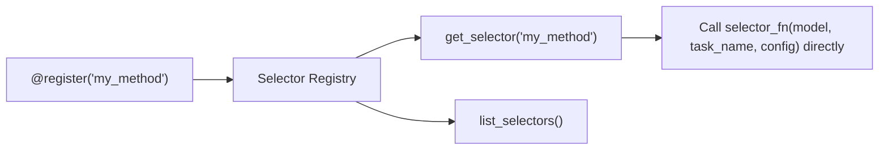

# Selectors

The **selector registry** is CircuitKit's unified interface for component scoring. Every discovery algorithm, pruning strategy, and quantization method is a registered selector function. This makes algorithms interchangeable and allows custom scoring functions to be plugged into any pipeline stage.

## The 14 registered selectors

```python
from circuitkit.selection import list_selectors
print(list_selectors())
# ['awq', 'cdt', 'eap', 'eap-gp', 'eap-ig', 'gptq', 'ibcircuit',
#  'magnitude', 'multi_granular', 'random', 'relp', 'tacq', 'taylor', 'wanda']
```

### Discovery selectors

Run the full discovery pipeline — load data, run attribution, return `{node_name: score}`:

| Selector | Backend | Stability | Description |
|---|---|---|---|
| `eap-ig` | EAP |  Stable | EAP + Integrated Gradients. **Default.** |
| `eap` | EAP |  Stable | Edge Attribution Patching |
| `eap-gp` | EAP |  Research | EAP with GradPath adaptive integration path |
| `relp` | EAP |  Research | Relevance Patching via LRP-style detach hooks |
| `ibcircuit` | IBCircuit |  Experimental | Information-Bottleneck noise model |
| `cdt` | CD-T |  Research | Contextual Decomposition |

### Compression selectors

Score model components for pruning/quantization decisions:

| Selector | Domain | Description |
|---|---|---|
| `magnitude` | Pruning | L2 norm of weight matrices |
| `taylor` | Pruning | First-order Taylor approximation of loss change |
| `multi_granular` | Pruning | Aggregated multi-scale scoring |
| `wanda` | Pruning | Weight × activation norm product |
| `gptq` | Quantization | GPTQ-style Hessian-based sensitivity |
| `awq` | Quantization | AWQ-style activation-weighted sensitivity |
| `tacq` | Quantization | Task-aware circuit-guided quantization |

### Baseline selector

| Selector | Domain | Description |
|---|---|---|
| `random` | Baseline | Random component scores — the null baseline Pillar 5 (Baselines) compares a discovered circuit against |

That is 6 discovery + 7 compression + 1 baseline = **14 registered selectors**. This is separate from the **13** discovery *algorithm* names in `DISCOVERY_ALGORITHMS` that `discover_circuit` dispatches on — only 6 of those 13 have a registered selector; the rest run through fixed branches in `circuitkit.api`.

## Using a selector

### In `discover_circuit`

The `algorithm` key selects the discovery selector:
```python
from circuitkit.api import discover_circuit

circuit = discover_circuit({
    "model": {"name": "gpt2"},
    "discovery": {"algorithm": "eap-ig", "task": "ioi", ...},
    "pruning": {"target_sparsity": 0.3, "scope": "heads"},
    "output_path": "./circuit.pt",
})
```

### Directly via `get_selector`

```python
from circuitkit.selection import get_selector

selector_fn = get_selector("eap-ig")
# (model, task_name, config_dict) -> Dict[str, float]
scores = selector_fn(model, "ioi", {"level": "node", "num_examples": 64})
```

## Registering a custom selector

There is no `register_selector` function — `circuitkit.selection` exports a `register(name)` decorator instead:

```python
from circuitkit.selection import register

@register("my_method")
def my_custom_selector(model, task_name, config):
    """Score components using your own method."""
    scores = {}
    for name, param in model.named_parameters():
        scores[name] = param.abs().mean().item()
    return scores
```

!!! warning "Registering a selector does not make it a `discover_circuit` algorithm"
    `discover_circuit`'s `discovery.algorithm` dispatch is a fixed set of branches limited to the 13 names in `DISCOVERY_ALGORITHMS` — it does **not** consult this registry for unknown algorithm names. Passing `"algorithm": "my_method"` raises `AlgorithmError` even after registering it above. Call your custom selector directly instead:

```python
from circuitkit.selection import get_selector

selector_fn = get_selector("my_method")
scores = selector_fn(model, "ioi", {"level": "node"})
```

### Selector contract

| | Discovery selector | Compression selector |
|---|---|---|
| Signature | `(model, task_name, config) -> Dict[str, float]` | `(model, task_name, config) -> Dict[str, float]` |
| Loads data? | Yes | No |
| Runs model forward? | Yes (attribution) | Optional (wanda, taylor) |
| Returns | Scores keyed by component name | Scores keyed by component name |

## Under the hood: how the registry works



The registry is a module-level dict. `register(name)` is a decorator that stores the function under `name`. `get_selector` returns the raw function for direct invocation. The six discovery selectors in the table above (`eap`, `eap-ig`, `eap-gp`, `relp`, `ibcircuit`, `cdt`) register this way internally, but `discover_circuit`'s `algorithm` dispatch does not read from this registry — it is a separate, fixed set of branches in `circuitkit.api`, limited to the 13 names in `DISCOVERY_ALGORITHMS`.

## Next steps

- [:octicons-arrow-right-24: Applications](applications.md)
- [:octicons-arrow-right-24: Tasks and Datasets](tasks.md)
